<p align="center">
  
</p>

<p align="center">
  
  
  
  
</p>

# MSP Tier 3 Toolkit

Welcome to the **MSP Tier 3 Toolkit** — a collection of high-impact PowerShell scripts designed to help Service Desk Technicians, System Admins, and MSP engineers troubleshoot faster, automate routine tasks, and deliver enterprise-level support with confidence.

## ⚡ Quick Start - 3 Easy Ways!

### 1. 🌐 Web Interface (NEW!)
**The easiest way to use the toolkit!**

Simply double-click: **`Launch Web UI.bat`** (Windows) or run:
```powershell
.\Launch-WebUI.ps1
```

Then open your browser to: **http://localhost:8080**

✨ Beautiful web interface with all tools in one place!
📖 See [WEB_UI_INSTRUCTIONS.md](./WEB_UI_INSTRUCTIONS.md) for details.

### 2. 📋 Interactive Menu
Run the standalone launcher (no dependencies required):
```powershell
.\WORKING_LAUNCHER_USE_THIS.ps1
```

### 3. 🎯 Full-Featured Launcher
Use the main launcher with all features:
```powershell
.\Launch-MSPToolkit.ps1
```

## 🔧 Available Tools

| Category | Script Name | Description |
|----------|-------------|-------------|
| **Diagnostics** | `SystemHealthReport.ps1` | Comprehensive system health check |
| | `BootTimeAnalyzer.ps1` | Analyze boot and shutdown times |
| | `ClientSystemSummary.ps1` | Generate HTML report for clients |
| **Active Directory** | `CheckADUserStatus.ps1` | Check user lockout and password status |
| **Microsoft 365** | `M365UserProvisioning.ps1` | Provision Office 365 licenses |
| **Maintenance** | `CleanupOldProfiles.ps1` | Remove old user profiles |
| | `Cleanup-Auto.ps1` | Comprehensive system cleanup |
| **Print Management** | `PrinterSpoolerFix.ps1` | Fix stuck print jobs |
| | `CheckAndStart-Spooler.ps1` | Auto-monitor print spooler |
| **Network** | `FixMappedDrives.ps1` | Test and repair mapped drives |
| **Software** | `RemoteUninstall.ps1` | Silently uninstall software |
| **Windows Update** | `WindowsUpdateFix.ps1` | Reset Windows Update components |

## ✨ Key Features

- ✅ **No Installation Required** - Just download and run
- 🌐 **Web Interface** - Access from any browser
- 📱 **Remote Execution** - Run scripts on remote computers
- 📊 **Beautiful Reports** - HTML output for clients
- 🔄 **Auto-Updates** - Keep your toolkit current
- 📝 **Comprehensive Logging** - Track all operations
- 🎨 **Color-Coded Output** - Easy to read results

## 🚧 Planned Additions

See [ROADMAP.md](./ROADMAP.md) for upcoming scripts and contributions.

## 📥 Installation

1. Clone or download the repository:
   ```powershell
   git clone https://github.com/dirtysouthalpha/msp-tier3-toolkit.git
   cd msp-tier3-toolkit
   ```

2. Launch the web interface:
   ```powershell
   .\Launch-WebUI.ps1
   ```

3. Or use the interactive menu:
   ```powershell
   .\WORKING_LAUNCHER_USE_THIS.ps1
   ```

## 🔐 Requirements

- **PowerShell 5.1+** (Built into Windows 10/11)
- **Administrator privileges** (for some scripts)
- **Windows OS** (tested on Windows 10/11 and Windows Server 2016+)

## 📚 Documentation

- [Web UI Instructions](./WEB_UI_INSTRUCTIONS.md) - How to use the web interface
- [Quick Start Guide](./QUICKSTART.md) - Get started in 5 minutes
- [Code Quality Improvements](./CODE_QUALITY_IMPROVEMENTS.md) - Recent enhancements

## 🤝 Contributing

Contributions are welcome! Please feel free to submit pull requests or open issues for bugs and feature requests.

---

> 💡 Most scripts are safe to run unattended — but always test in a non-production environment first.

**Version:** 2.0.0 | **Dazzle. Automate. Dominate.** 🚀

---

## Support this project

Built and maintained by one person, in the open. If it saves you time or
money, you can throw something in the hat — entirely optional, and it changes
nothing about the license or what ships.

<a href="https://cash.app/$vladien"></a>

**Cash App — [$vladien](https://cash.app/$vladien)**

Scan the code, or follow the link.

No tiers, no paywalled features, no "pro" build.

<br clear="left">

---
### More from Dirty South Alpha
*Self-hosted AI. Security-first. Always innovating.*

- 🚀 [intel-arc-llm-stack](https://github.com/dirtysouthalpha/intel-arc-llm-stack) — run any LLM locally on Intel Arc
- 🎛️ [muse-maestro](https://github.com/dirtysouthalpha/muse-maestro) — guardrails, memory & cost telemetry for Meta Muse Code
- 🤖 [sentinel-code](https://github.com/dirtysouthalpha/sentinel-code) — multi-provider AI coding agent with smart model routing
- 📊 [intel-arc-llm-benchmarks](https://github.com/dirtysouthalpha/intel-arc-llm-benchmarks) — real Arc B60 inference numbers
- 👤 [@dirtysouthalpha](https://github.com/dirtysouthalpha) — the full fleet

⭐ If this saved you time, star it and follow for more.

---
<p align="center"><sub><b>Dirty South Alpha™</b> · © 2026 · <a href="https://dirtysouthalpha.com">dirtysouthalpha.com</a> · self-hosted AI · security-first</sub></p>
